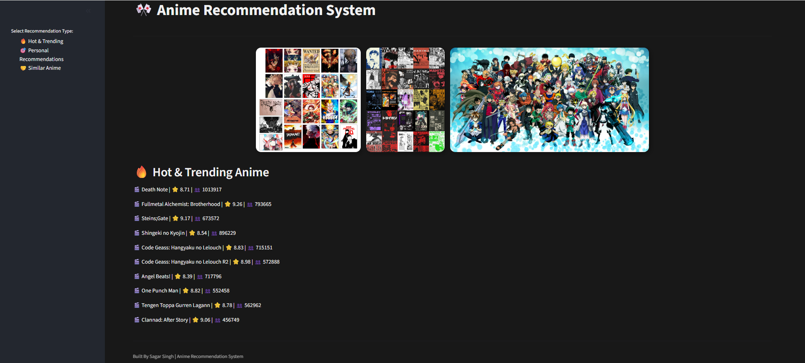
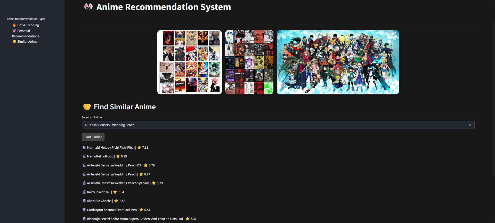

# 🎌 Anime Recommendation System

[](https://anime-recommendation-system-h8xquwqb3bq3bdkahzuqcn.streamlit.app/)

---

## 📌 Project Overview

This project builds an **Anime Recommendation System** that provides personalized and general recommendations based on **anime ratings, user interactions, and genre similarity**.

The system implements **popularity-based ranking, content-based filtering, and collaborative filtering**, allowing users to explore trending anime, find similar shows, or receive recommendations tailored to their preferences.

---

## 🎯 Problem Statement

To design a **recommendation system** that helps anime watchers discover anime:

- Based on popularity and community engagement (**Hot & Trending**)  
- Personalized suggestions for a given user (**Collaborative Filtering**)  
- Similar anime based on genre (**Content-Based Filtering**)

---

## 📊 Dataset

- **Anime Dataset:** `anime.csv` – contains anime metadata like name, genre, type, rating, episodes, and members.  
- **Ratings Dataset:** `rating.csv` – contains user ratings for anime (`user_id`, `anime_id`, `rating`).  

**Dataset Source:** [Kaggle – Anime Recommendation Database](https://www.kaggle.com/datasets/CooperUnion/anime-recommendations-database/data)

---

## 🔎 Exploratory Data Analysis (EDA)

- Checked **missing values** and data types.  
- Analyzed **genre distribution**, episode counts, and rating distributions.  
- Visualized **popular anime by members** and **average ratings**.  
- Identified active users and frequently rated anime to optimize memory usage.

---

## 📐 Data Cleaning & Preprocessing

- Filled missing values for `genre`, `type`, `episodes`, and `rating`.  
- Converted numeric columns and handled invalid entries.  
- Aggregated multiple ratings per user-anime pair by taking the **mean**.  
- Normalized and weighted anime scores for popularity-based ranking.

---

## 🤖 Recommendation Approaches

### 1️⃣ Popularity-Based (Hot & Trending)
- Weighted scoring using **ratings and number of members**.  
- Normalized scores to create a **final score** ranking.

### 2️⃣ Content-Based Filtering
- Uses **TF-IDF vectorization** of genres.  
- Computes **cosine similarity** between anime to recommend similar shows.

### 3️⃣ Collaborative Filtering
- Builds a **user-item interaction matrix**.  
- Computes **item-item similarity** for personalized recommendations.  
- Filters out low-activity users and unpopular anime for memory efficiency.  

---

## 💻 Streamlit Web Application

Interactive **Streamlit app** with three main tabs:

1. **🔥 Hot & Trending:** Shows top-ranked anime by weighted score.    
2. **🤝 Similar Anime:** Users select an anime to see **genre-based similar shows**.  

Features:
- Modern UI with custom CSS  
- Ratings and member count visualization  
- Real-time recommendations without pre-trained models  

---

## 📸 Screenshots

### 1️⃣ Hot & Trending


### 2️⃣ Personal Recommendations


### 3️⃣ Similar Anime


---

## 💻 Features

- **Popularity-Based Recommendations:** Weighted scoring based on ratings and members.  
- **Collaborative Filtering:** Personalized recommendations using user-item interactions.  
- **Content-Based Filtering:** Suggests similar anime based on genres.  
- **Memory Efficient:** Uses sparse matrices and caching for faster performance.  
- **Interactive UI:** Built with Streamlit for easy navigation.

---

## 📂 Project Structure

```

anime-recommendation-system/
├── anime.csv
├── rating.csv
├── dark_theme.css
├── app.py
├── README.md
├── screenshots/
│   ├── hot_trending.png
│   ├── personal_recommendations.png
│   ├── similar_anime.png
├── requirements.txt
├── code.ipynb
└── .gitignore
```

---

## ⚙️ Installation

1. Clone this repository:

```bash
git clone https://github.com/SagarSingh2004/anime-recommendation-system.git
cd anime-recommendation-system
```

2. Create a virtual environment and install dependencies:

```bash
python -m venv myenv
source myenv/bin/activate      
myenv\Scripts\activate         
pip install -r requirements.txt
```

3. Run the Streamlit app:

```bash
streamlit run app.py

```

---

## 🛠 Technologies Used

- Python
- Streamlit
- Pandas & NumPy
- Scikit-learn (TF-IDF, Cosine Similarity)
- SciPy (Sparse matrices)

---


## 👨‍💻 Author

**Sagar S**

Data Science Enthusiast
